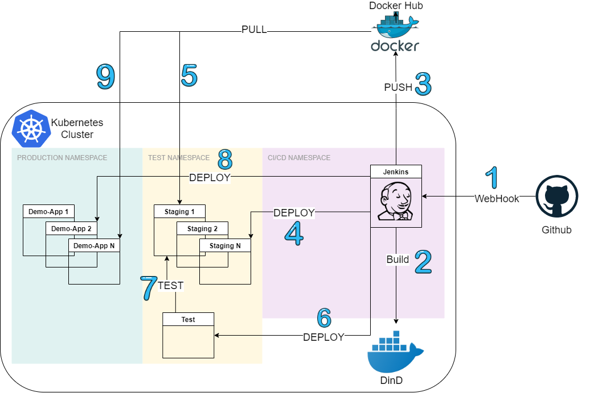

# Demo CI/CD Project
> This demo project contains a hello world web application and its journey to production!

## Table of contents
* [General Info](#general-info)
* [Technologies](#technologies)
* [Setup](#setup)
* [Additional Information](#additional-information)

## General info
This demo project has a simple web application written in go. It returns message with your Name parameter.(e.g. localhost:11123?Name=anil)  
For build this application in Jenkins(in the spirit of CI/CD) you need a jenkins server in Kubernetes Cluster which has Docker-in-Docker support and has kubectl with service account. 
All the build are realized in a docker agent of jenkins server and all the deploys are doing by kubectl in jenkins. 
If you want to full automate build you need to setup trigger on jenkins or create webhook on git account. So you can make auto-builds after every commit. 

## Technologies
* Kubernetes - version 1.19
* Docker - version 19.03
* Jenkins - version lts
* Golang - version 1.15
* Yaml

## Setup
* Kubernetes - You can build a minikube cluster or try cloud provider's kubernetes service for this workloads
* Docker - Since this repository assumes you are using DinD for deployment process there is no need extra steps after created kubernetes cluster
* Jenkins - It can be deployed as a deployment and you need to volume docker unix socket(/var/run/docker.sock) for integrating native docker API.Also you need to install kubectl(You can build a new container based Jenkins and install it this dependencies).
* Golang - You can simply use golang official container

## Additional Information 

Here are the steps of this workload
 

 
<ol start="1">
  <li>After pushed a commit to github address Jenkins start to build process and pull repo</li>
  <li>It builds the image from Dockerfile</li>
  <li>After build it pushes image to docker registry</li>
  <li>In this step jenkins applies the demo.yaml file with new container configuration.</li>
  <li>Hence applied new confiuration to workload it starts with new version of the container.</li>
  <li>In this step we deploy a test job and it tests our new version.If it fails all the jenkins pipeline set to failed state.</li>
  <li>If the test was successfull You need to APPROVE for deploying the new version to production environment.After approve it new configuration transmit to product namespace.</li>
  <li>It pulls the new version of container so our new version now on the production.</li>
</ol>

* demo.yaml : It has a nodeport service for access our web api and a deployment for running container.Also a HPA object for scaling in the kubernetes cluster.
* test.yaml : It has a testing job for our web container.Also a config map for testing script.For sake of a simplicity it has only a curl to api and take result.